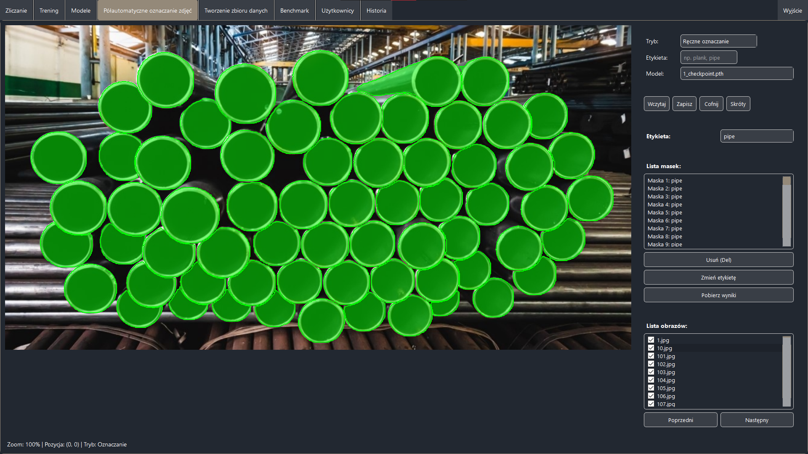

# SMLE (System Maszynowego Liczenia Elementów)

# Uruchomienie projektu
Upewnij się, że masz zainstalowane Docker oraz Docker Compose
docker-compose up --build 

Frontend uruchamiany jest ręcznie przy użyciu
python frontend/main.py
Upewnij się, że masz zainstalowane wymagane biblioteki `frontend/requirements.txt`

# Najważniejsze technologie użyte w projekcie

* Python
* Docker
* Docker Compose
* Mask R-CNN
* Faster R-CNN
* MRCNN
* PyTorch 
* OpenCV

# Interfejs użytkownika

## 1. Zliczanie

## 2. Trening

## 3. Modele

## 4. Oznaczanie zdjęć

## 5. Tworzenie zbiorów danych

## 6. Benchmark

## 7. Użytkownicy

# Licencje

Projekt korzysta z bibliotek open source. Pełna lista bibliotek, ich wersje, licencje oraz data weryfikacji znajdują się w pliku `licences/THIRD_PARTY_LICENSES.md`. Teksty licencji dla każdej biblioteki są dostępne w folderze `licences`.