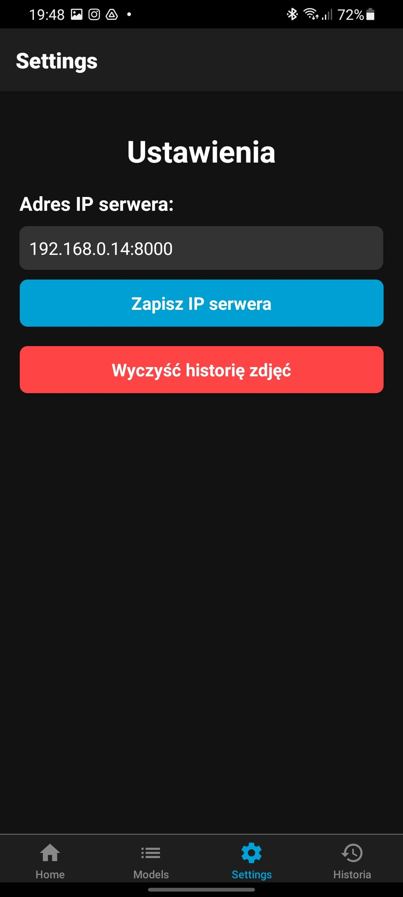

# SMLE (System Maszynowego Liczenia Elementów)

## Opis projektu

**SMLE (System Maszynowego Liczenia Elementów)** to zaawansowana aplikacja do automatycznego zliczania i analizy elementów na obrazach przy użyciu technik widzenia komputerowego i uczenia maszynowego. Projekt integruje backend oparty na modelach głębokiego uczenia (Mask R-CNN, Faster R-CNN, MRCNN) z intuicyjnym interfejsem użytkownika, umożliwiającym zliczanie obiektów, trening modeli, oznaczanie danych, zarządzanie zbiorami danych, benchmarking oraz administrację użytkownikami. Wykorzystuje technologie takie jak Python, PyTorch, OpenCV, Docker i Docker Compose, zapewniając skalowalność i łatwość wdrożenia. Aplikacja jest przeznaczona do zastosowań w przemyśle, logistyce czy badaniach naukowych, gdzie wymagana jest precyzyjna detekcja i analiza obiektów na obrazach.

## Uruchomienie projektu

1. Upewnij się, że masz zainstalowane **Docker** oraz **Docker Compose**.

2. Uruchom projekt za pomocą:

   ```bash
   docker-compose up --build
   ```

3. Frontend uruchamiany jest ręcznie:

   - Zainstaluj wymagane biblioteki z pliku `frontend/requirements.txt`:

     ```bash
     pip install -r frontend/requirements.txt
     ```

   - Uruchom aplikację frontendową:

     ```bash
     python frontend/main.py
     ```

## Najważniejsze technologie użyte w projekcie

- **Python**: Główny język programowania dla backendu i frontendu.
- **Docker**: Konteneryzacja aplikacji dla łatwego wdrażania.
- **Docker Compose**: Orkiestracja wielu kontenerów.
- **Mask R-CNN**: Model głębokiego uczenia do segmentacji instancji.
- **Faster R-CNN**: Model do wykrywania obiektów.
- **MRCNN**: Rozszerzenie Mask R-CNN dla zaawansowanej detekcji.
- **PyTorch**: Framework do uczenia maszynowego.
- **OpenCV**: Biblioteka do przetwarzania obrazów.

# Interfejs użytkownika

## 1. Zliczanie
- Ekran zliczania umożliwia wgranie obrazu wejściowego do analizy. Użytkownik może wybrać modele Mask R-CNN, Faster R-CNN lub MCNN. Możliwa jest również opcja wyboru preprocesingu który znacznie poprawia wyniki detekcji MCNN.
- Wynik detekcji obiektów na obrazie. Pokazuje obraz z naniesionymi maskami lub ramkami bounding box wokół wykrytych elementów, wraz z ich liczbą i etykietami klas, wygenerowanymi przez wybrany model.
### Poniżej przedstawiono przykład detekcji przy użyciu modelu Mask R-CNN.


## 2. Trening
Moduł treningu pozwala użytkownikowi na konfigurację i uruchamianie procesu uczenia modeli głębokiego uczenia. Umożliwia wybór hiperparametrów, takich jak liczba epok, learning rate, oraz wgranie oznaczonych zbiorów danych do treningu.


## 3. Modele
Sekcja zarządzania modelami wyświetla listę dostępnych modeli (np. Mask R-CNN, Faster R-CNN, MCNN) wraz z ich metadanymi, takimi jak data treningu, wersja czy metryki wydajności.


## 4. Oznaczanie zdjęć
- Narzędzie do półautomatycznego oznaczania obrazów umożliwia użytkownikowi dodawanie etykiet i masek dla obiektów na zdjęciach, tworząc dane treningowe dla modeli. Interfejs wspiera precyzyjne rysowanie poligonów i bounding boxów.
- Narzędzie pozwala na wybór wcześniej wytrenowanego modelu Mask R-CNN, którego zadaniem jest wstępne oznaczenie zdjęć co przyspiesza proces oznaczania.


- Widok skrótów klawiszowych dla narzędzia do oznaczania, ułatwiających szybkie wykonywanie operacji.


## 5. Tworzenie zbiorów danych
Moduł tworzenia zbiorów danych pozwala na organizację i walidację oznaczonych obrazów w zestawy treningowe, walidacyjne i testowe. Użytkownik może zarządzać metadanymi zbiorów i eksportować je w formatach zgodnych z PyTorch.


## 6. Benchmark

- Ekran benchmarku prezentuje wyniki testów wydajności modeli na wybranym zbiorze danych, w tym metryki takie jak MAE oraz skuteczność.


- Porównanie wydajności różnych modeli (np. Mask R-CNN vs. Faster R-CNN) w formie listy z podziałem na zestaw danch, umożliwiające wybór optymalnego modelu dla konkretnego zastosowania oraz najlepszego modelu z całego zestawienia.


## 7. Użytkownicy
Panel administracyjny do zarządzania użytkownikami aplikacji. Pozwala na dodawanie i podgląd kont.


# Aplikacja mobilna
Aplikacja mobilna napisana w React Native, zaprojektowana do analizy zdjęć w celu wykrywania elementów przy użyciu serwera FastAPI. Aplikacja przesyła zdjęcia do zdalnego serwera, który wykonuje analizę zdjęć przy użyciu znajdujących się na serwerze modeli, zwracając wyniki w czasie rzeczywistym. Aplikacja znajduje się w `docs/app-relase.apk`

## Funkcjonalności
- **Wybór zdjęć**: Użytkownik może robić zdjęcia aparatem lub wybierać je z galerii.
- **Analiza na FastAPI**: Zdjęcia są przesyłane do serwera FastAPI, który wykorzystuje modele Faster R-CNN, Mask R-CNN oraz MCNN do analizy i generowania wyników.
- **Historia**: Zapisuje historię analiz i zdjęć w pamięci urządzenia.
- **Powiadomienia**: Wysyła powiadomienia push po zakończeniu analizy na serwerze.
- **Interfejs użytkownika**: Intuicyjny UI z widokiem wyników analizy, w tym liczbą wykrytych elementów i przetworzonymi obrazami.

## 1. Zliczanie

Ekran *Home* pozwala użytkownikowi wybrać zdjęcia do analizy, albogrytm oraz model. Po lewej stronie widoczne jest zdjęcie przed analizą, a po prawej – wynik analizy wykonanej przez serwer FastAPI.

<table>
  <tr>
    <td></td>
    <td></td>
  </tr>
</table>

## 2. Lista modeli 

Ekran *Models* wyświetla dostępne modele wizji komputerowej, które mogą być wykorzystane na serwerze FastAPI do analizy zdjęć. Użytkownik może wybrać preferowany model, co pozwala na elastyczne dostosowanie procesu analizy.


## 3. Ustawienia

Ekran "Ustawienia" umożliwia użytkownikowi konfigurację aplikacji. Ustawienia są zapisywane lokalnie na urządzeniu.



## 4. Historia

Ekran "Historia" pokazuje listę wcześniej wykonanych analiz, w tym zdjęcia przed i po analizie oraz szczegóły, takie jak liczba wykrytych elemntów.


## Instalacja aplikacji mobilnej

Poniższe kroki opisują, jak skonfigurować i uruchomić aplikację mobilną **SMLE** opartą na React Native. Upewnij się, że masz zainstalowane wszystkie wymagane narzędzia przed rozpoczęciem.

### 1. Przygotowanie środowiska
- Zainstaluj **Node.js** (zalecana wersja LTS: 18.x lub wyższa).
- Skonfiguruj **Android SDK** przez Android Studio.
- Zainstaluj **Gradle** (zazwyczaj dostarczany z Android Studio).
- Upewnij się, że masz skonfigurowane środowisko React Native. Szczegółowe instrukcje znajdziesz w [oficjalnej dokumentacji React Native](https://reactnative.dev/docs/environment-setup).

### 2. Sklonowanie repozytorium
Sklonuj repozytorium projektu i przejdź do katalogu aplikacji:

```bash
cd "SMLE app/SMLE"
```

### 3. Instalacja zależności
Zainstaluj wszystkie wymagane biblioteki Node.js:

```bash
npm install
```

### 4. Czyszczenie i budowanie projektu
Uruchom aplikację na urządzeniu lub emulatorze Androida:

```bash
npx react-native run-android
```

> **Uwaga**: Upewnij się, że emulator Androida jest uruchomiony lub urządzenie fizyczne jest podłączone przez USB z włączonym trybem debugowania.

# Licencje

Projekt korzysta z bibliotek open source. Pełna lista bibliotek, ich wersje, licencje oraz data weryfikacji znajdują się w pliku `licences/THIRD_PARTY_LICENSES.md`. Teksty licencji dla każdej biblioteki są dostępne w folderze `licences`.